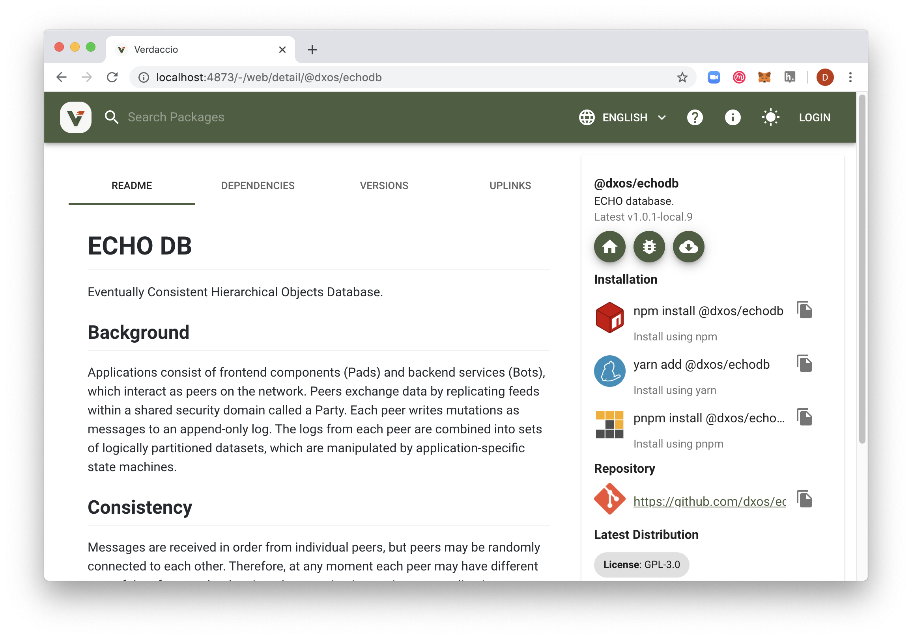

# Avoid yarn link by using a local registry proxy

Problem: replace one or more dependent packages of a project under development with 
modified versions (e.g. debug output added, bug fixed, new feature implemented). Often this
is done using [`yarn link`](https://classic.yarnpkg.com/en/docs/cli/link/) 
or [yalc](https://github.com/whitecolor/yalc). However these both have 
limitations and annoyances. 

Solution: use a locally run npm repository proxy to "eclipse" any public package with a
locally published version. `yarn install` fetches project dependencies from the
local repository which in turn proxies to npmjs.org unless a package with the same
name has already been locally published. 

Example using the [Verdaccio](https://github.com/verdaccio/verdaccio) repository proxy:

1. Install Verdaccio:
    ```
    $ yarn global add verdaccio

    ```
1. Run Verdaccio daemon (it is not necessary to edit its config file):
    ```
    $ verdaccio 
    warn --- config file  - /Users/david/.config/verdaccio/config.yaml
    warn --- Verdaccio started
    warn --- Plugin successfully loaded: verdaccio-htpasswd
    warn --- Plugin successfully loaded: verdaccio-audit
    warn --- http address - http://localhost:4873/ - verdaccio/4.6.2
    ```
1. Set YARN_REGISTRY to point to the local registry:
    ```
   $ export YARN_REGISTRY=http://localhost:4873/

    ```
1. `git clone` a dependent package, in this example `@dxos/echodb`, modif, build then publish
(enter a version that is higher than the current public version; on first run you will be
prompted to enter a new password):
    ```
   $ yarn publish
   [1/4] Bumping version...
   info Current version: 1.0.0-beta.1
   question New version: 1.0.1-local.10
   info New version: 1.0.1-local.10
   [2/4] Logging in...
   info npm username: david
   info npm email: david@wireline.io
   question npm password: 
   success Logged in.
   [3/4] Publishing...

    ```
   
    The locally published package will now be visible in Verdaccio's web interface:
    
1. In the depending project, use `yarn upgrade` to target the new version of `@dxos/echodb`:
    ```
   $ cd examples/playground
   $ yarn upgrade @dxos/echodb@^1.0.1-local.10 

    ```
   The locally published package now appears as a dependency:
   ```
   $ yarn why @dxos/echodb
   .
   .
   .
   => Found "@wirelineio/playground#@dxos/echodb@1.0.1-local.10"
   info This module exists because "_project_#@wirelineio#playground" depends on it.
   .
   .
   .

   ```
